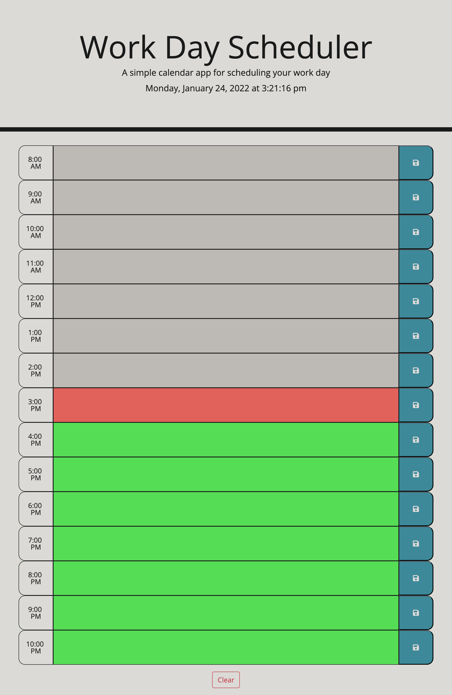

# Day Planner

## Main Objective:
- The main goal of this project is to let the users input any value into the textarea and let it save onto the page even through a page refresh.
- The user should be able to put in their schedule for the day and save it on the page so that they may look back at it and be more organized.
- The user should also be able to see their current schedule with the background colors provided. With grey being the past, red being the present, and green being the future.

## Skills Applied:
- HTML, CSS, and JavaScript were all used to create this web application.
- With HTML, I added the textarea, save button, and clear button.
- With CSS, I added simple styling to the page to make it look neater.
- With JavaScript, I was able to use local storage to save the textarea values to the page and was able to make the save button and clear button interactive. The current clock in the header was also created by JavaScript. Also, the background colors of grey, red, and green represent the past, present, and future respectively. This was done through moment.

## Screenshot of Web Application:

## Live Links:
### Github:
- https://github.com/calvin-kim13/dayPlanner
### Web Application:
- https://calvin-kim13.github.io/dayPlanner/